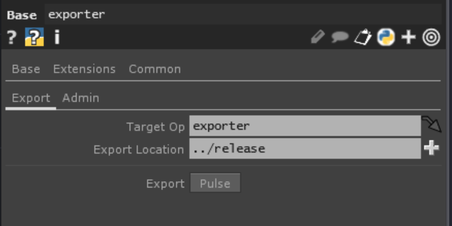

# Touchdesigner Tox Exporter
A repo used to externalize assets and export fully contained tox files.

## Purpose
This project is incredibly heavily influenced by [Matthew Ragan's template tox repo](https://github.com/raganmd/touchdesigner-template-tox-dev). I wanted a version of it that was more of exactly what I wanted and it was easier for me to do so with a new repo rather than a fork. 

## The Exporter
This project is used to create self contained `.tox` files, and the result of this project is itself a `.tox` file. The operator `/exporter` is a component that can be used to export `tox`s including itself. If you just want to export your own `.tox` grab the `ToxExporter` from the `release` folder which can be brought into any touch file.

### Exporting A Component
The exporter can export any component. There are 3 steps:
1. On the component you want to export, add the parameter `Modulename` which is the name of the exported tox. Note that this `Modulename` cannot be the same as the op's `name`.
2. On the exporter set the parameters `Export > Target Op` to the comp to export and set the `Export > Export Location` to the folder you want the tox to be exported to. Note that it will overwrite any existing export.
3. Press the `Export > Export` button. This will either produce a popup which will mark success or errors will be thrown. Be sure to check the textport.

## License
This project is open source software [licensed as MIT](./LICENSE).

